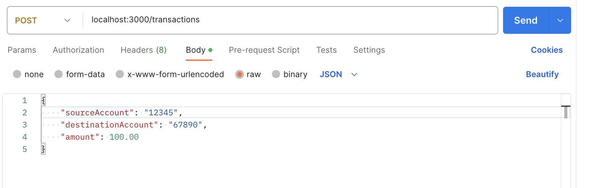

# Handson Modul 2.2

# Catatan:
- handson ini hanya mendemonstrasikan bagaimana n-layered architecture (controller, model, service) dengan node dan express js
- Tidak menggambarkan best practice file structure di node dan express js

# How to Setup
- clone repo ini
- run command `npm install`

# How to Run
- run command `node controllers/transactionController.js`

# How to Test
Test it using req body of raw json object

e.g.
